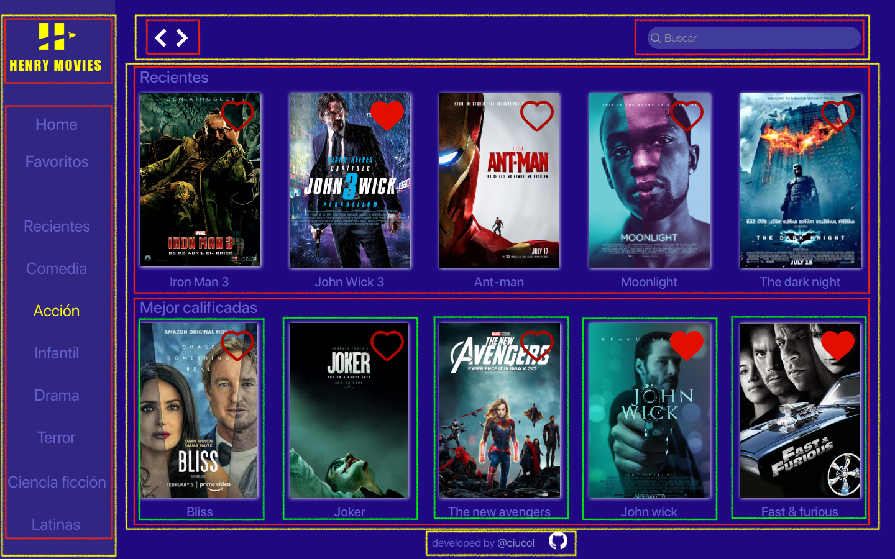
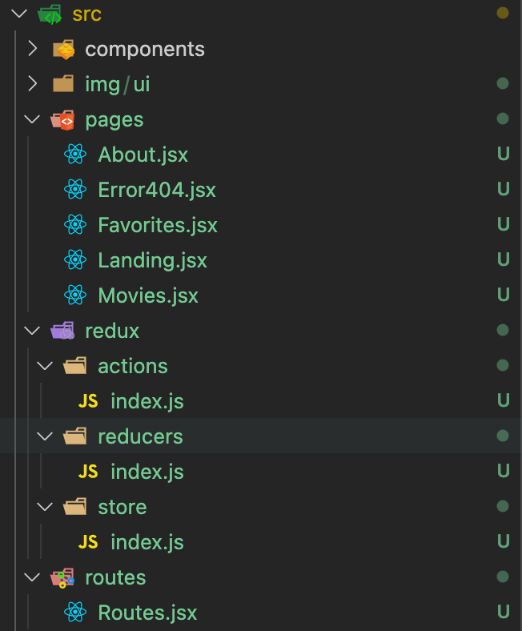

# Henry Movies / Primer proyecto con Redux (Alone)

### `Día 1`

**Martes 11 de mayo de 2021**

1. Inicio el proyecto usando
   ```
   npx create-react-app nombredelproyecto //el nombre del proyecto debe ser todo minúsculas
   ```
2. Instalo `React Router`para manejar las rutas usando `npm install react-router-dom`
3. Instalo `Redux React`para manejar el estado global en la store usando `npm install react-redux`
4. Creo un repo en GitHub, agregó localmente el remote usando

   ```
   git remote add origin nombreDelRepoEnGithub
   ```

5. Creo la carpeta `components` para crear y administrar los componentes
6. Creo la carpeta `pages` para manejar todas las vistas
7. Creo la carpeta `redux`para manejar lo relacionado con Redux
8. Creo la carpeta `routes`para manejar las rutas
9. Creo una carpeta `ìmg`
   Las carpetas las creo en `src`
10. creo en la carpeta `routes` un archivo `routes`para manejar las rutas de la app que serán 4 el path `/` que mostrará la landing, el path `/movies` que mostrarà la lista de películas, el path `/favorites` mostrará los favoritos y buscaré que se puedan guardar en `local storage` y el path `/about` que carga este readme, voy a tratar de traerlo de la API de github. No se si se pueda hacer -> [Documentación Api de Github](https://docs.github.com/en/rest/reference/repos#get-a-repository)

## Estos son los diseños de la primera versión

<figure>
    
    <figcaption>Landing - path="/"</figcaption>
    <br/>
    
    <figcaption>Vista películas - path="/movies"</figcaption>
    <br/>
    
    <figcaption>Modal de descripción de película (aún no se si es otro path) - path="/modal"</figcaption>
    <br/>
    
    <figcaption>Vista favoritos - path="/favorites"</figcaption>
    <br/>
    
    <figcaption>Componentes"</figcaption>
    <br/>
</figure>

8. Reviso la documentación de GitHub para escribir de manera decente un Readme 😳 -> [Documentación Readme - GitHub](https://docs.github.com/es/github/writing-on-github/basic-writing-and-formatting-syntax)
9. Creo las rutas usando la documentación oficial de [React Router](https://reactrouter.com/web/guides/quick-start)
10. Finalizo fase de planeación con el arbol de archivos
<figure>
    
    <figcaption>Landing - path="/"</figcaption>
    <br/>
</figure>

11. Realizo commit "Configuración inicial Pages-Components-Routes-Redux"
